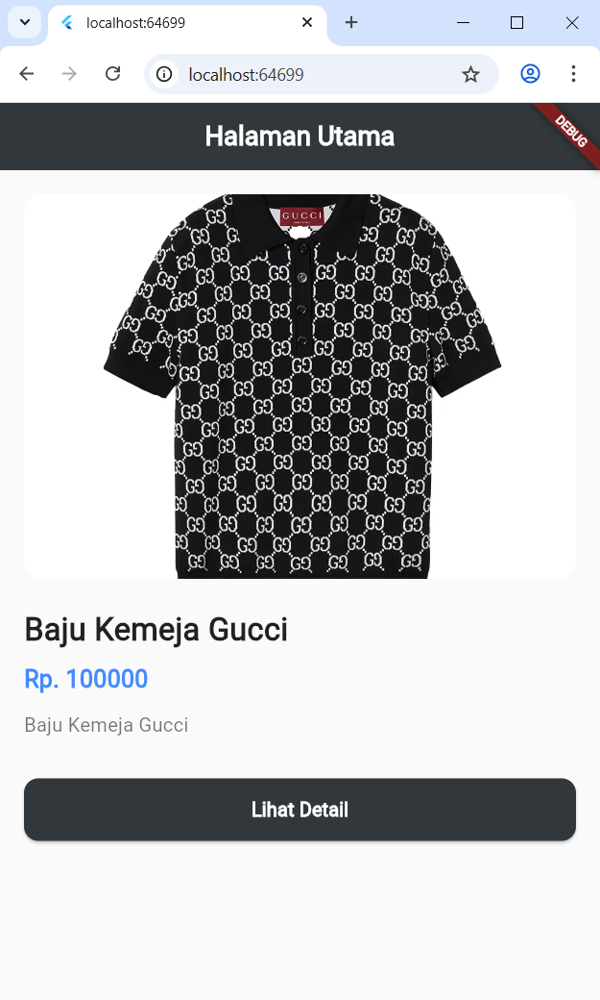
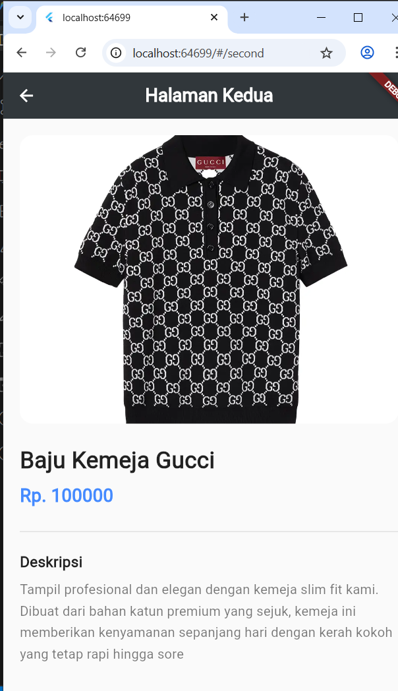

# Katalog Produk App

Aplikasi Katalog Produk sederhana berbasis **Flutter** yang menampilkan visual produk secara detail dan elegan.

## 📌 Deskripsi Proyek

Proyek ini (Pertemuan 5 - 2306082) dibuat sebagai bentuk pengembangan antarmuka (UI) dalam Flutter menggunakan konsep mengoper data (passing data) antar halaman (*screen*) dan implementasi *navigation routing* dasar. Saat ini, aplikasi mendemonstrasikan produk contoh berupa "Baju Kemeja Gucci" beserta cuplikan singkat, harga proporsional, dan rincian deskripsi spesifiknya pada halaman selanjutnya.

## 🚀 Fitur Utama

- **Halaman Utama (Home Page)**: 
  - Menampilkan ringkasan produk utama seperti gambar (memanfaatkan Network Image), nama produk, dan harganya.
  - Mengimplementasikan UI yang modern dan *clean* (gambar dengan lengkungan sudut `ClipRRect`, latar belakang lembut, dan struktur aman dari *overflow* via `SingleChildScrollView`).
  - Dilengkapi dengan *ElevatedButton* untuk beralih ke halaman penjelasan detail.

- **Halaman Detail (Second Page)**:
  - Menerima dan merender data dari halaman sebelumnya.
  - Membaca deskripsi produk secara panjang lebar untuk UX yang lebih meyakinkan (misalnya, informasi seputar kecocokan outfit atau bahan kemeja).
  - Tampilan tipografi (*typography*) seragam dan elegan yang menyatu dengan *styling* halaman utama.

## 🛠️ Teknologi dan Komponen yang Digunakan

- **SDK/Platform**: [Flutter](https://flutter.dev/) (Framework UI oleh Google)
- **Bahasa**: Dart
- **Komponen Inti**: `Scaffold`, `AppBar`, `ClipRRect`, `Image.network`, `SingleChildScrollView`, `Column`, `ElevatedButton`, dan `Divider`.

## 🚦 Panduan Menjalankan Aplikasi

Ikuti panduan berikut untuk memulai dan menjalankan aplikasi pada mesin (PC/Laptop) Anda:

1. Pastikan Anda telah menginstal komponen lokal lingkungan pengembangan, yakni **Flutter SDK**.
2. Masuk / arahkan terminal ke direktori *project* ini (`pertemuan5_2306082`).
3. Dapatkan seluruh dependensi yang mungkin terdaftar dengan menjalankan:
   ```bash
   flutter pub get
   ```
4. Jalankan aplikasi pada *emulator* Android/iOS, atau menuju piranti *web* via Chrome secara langsung:
   ```bash
   flutter run
   ```

## 📝 Catatan / Changelogs

- **Pembaharuan UI**: Telah dimodifikasi dari *layout* standar untuk mempunyai skema warna, spasi (*padding*), ketebalan teks, dan radius garis (*border*) ala aplikasi *E-Commerce* atau katalog fashion profesional berstandar industri (*Standard Styling*).


## Berikut Screenshot Dari Tampilan Aplikasi

### Halaman Utama



### Halaman Detail


